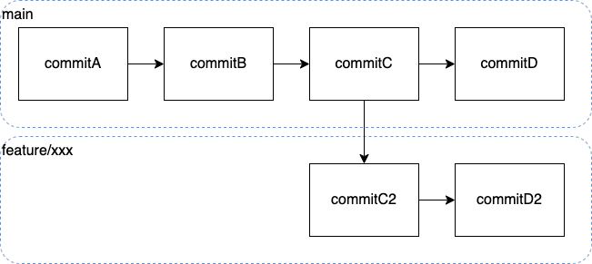
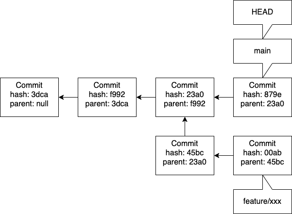

# ブランチとコミット

Gitはスナップショットと呼ばれるある時点での全ファイル群を保持しています。（もちろん普通は変更がないファイルの方が多いのでそこは効率化がかかっています）

ユーザーがコミットをすると、コミットオブジェクトと呼ばれるスナップショットへのポインタ、メタデータ、親コミットへのポインタが含まれるデータが作成されます。

そしてコミットがいくつも連なることで履歴が記録されていきます。

Gitはブランチというものが作成できます。ブランチというのは作成した時点で最も上位のコミットを指し示すポインタとなり、HEADという特別なポインタがカレントブランチとして動きます。

つまりブランチの構造はこういう印象が持たれがちなのですが、

実態はこういうことなのです。

しかし1枚目の図はフローを表すのには最適です。そのため1枚目の図はあながち間違いではない、ということは心に留めておいてください。

難しい話をしてしまいましたが、ブランチを作成するというのは新しくポインタを作成するということでしかなく、ゆえにブランチの作成は軽量であるということは知っておいて損はないと思います。
