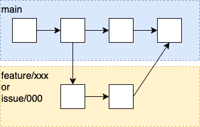

# 開発フロー

PlayGroundでは以下の開発フローをしています。プロジェクトにアサインされた際には概ねこれに従って開発してください。

- feature/{機能の概要}(またはissue/{issue番号})の名前でブランチを作成する。
- 機能を開発する。
- PRを出す。
- approveがもらえたらmain(またはdev)ブランチにマージする。
- マージ済みブランチは削除する。

