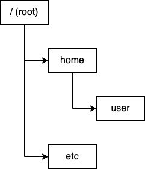

# ディレクトリ構造

windowsを使っている人でいうフォルダと同じ感じですが、ファイルへのパスはディレクトリ構造で表されます。

しばしば`/path/to/file`という表現を見かけることがあるように、`/`でディレクトリを区切って表します。

## 絶対パス
ルートディレクトリ（一番上のディレクトリ）からのパスを絶対パス(absolute path)といいます。

## 相対パス

カレントディレクトリ（自分が今いるディレクトリ）からのパスを表します。カレンとディレクトリは`.`で表されます。上位のディレクトリを示すときは`..`を使います。

## ホームディレクトリ

ログインした時のディレクトリです。`~`がエイリアスとして使えます。
