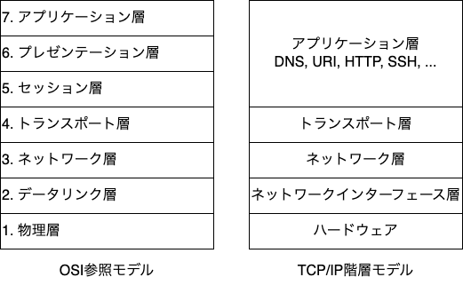

# インターネット

複数のコンピュータ同士をケーブルまたは無線を用いて接続し、情報のやりとりをできるようにした仕組みのことをネットワークと呼びます。

このネットワーク上において、サービス、情報を提供するコンピュータをサーバー、利用するコンピュータをクライアントと呼びます。

インターネットとは今では全世界を接続しているネットワークのことを指します。

インターネットを利用して通信を行うためにはTCP/IPが欠かせません。

ところで、TCP/IPとはなんでしょうか？TCP/IPとはインターネットを運用するにあたって開発されたプロトコルです。プロトコルというのは、情報をやり取りするための共通言語のようなものです。

OSI参照モデルというのがあり、TCP/IPではそれに倣って階層モデルを構築しています。

