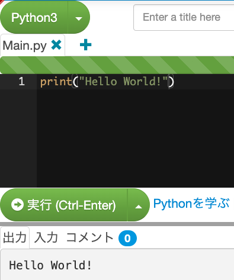

# 準備編

いざ！のその前に、少しだけ準備をします。今回書くコードのエディタは[paiza.io](https://paiza.io/ja)を利用します。また、言語には後々の都合上[Python](https://www.python.org/)を使用します。

しばしばコードブロックと呼ばれるもの
```python
print("Hello World!")
```
が現れます。これをpaizaのコードエリアにコピペして実行ボタンを押して結果を確認してみましょう。


ではいってみましょー。
