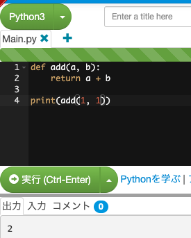

# 関数

関数と聞くとy=f(x) みたいなのを想像する方がいると思いますが、プログラミングにおける関数とは、文（式）の集合体です。関数に渡される値を引数(arguments)、関数から渡される値を戻り値（返り値）といいます。

下の画像を見てみましょう。


Pythonにおいて関数は
```python
def name(in1):
    return in1
```

のように定義します。関数だからといって引数がなにもなくても構いませんし、何も返さなくても構いません。なんならなにもしないという関数を定義しても構いません。

関数を呼び出すときは関数名の後ろに`()`をつけ、`()`の中に引数を入れます。

```python
def f(x):
    return x
print(type(f), f(1))
```

Pythonにおいてはインデントという空白(またはtab)によるずらしが大事で、基本的にはネストと呼ばれる中身を記述する際には4つ(2つという派閥もあります)空白文字を入れます。

型についてやったのに型の記述なくない？って思った方はするどいです。Pythonでは基本的に関数の定義に型の情報を必要としていません。しかしアノテーションという形で型情報を与えることができます。
よっぽど複雑な形でない限りは書いておくといいです。


## 演習
1. 整数型の引数を2つ渡して2個の積を返す関数を定義してみましょう。関数名は`multiple`で。
2. 定義した関数を実行して合っているか確認してみましょう。

::: details 答え
```python
def multiple(a: int, b: int) -> int:
    return a * b
```
:::
