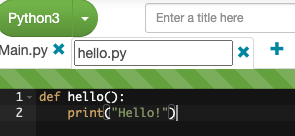

# モジュール
別のファイルで同じ処理を書いているのに、こっちのファイルでも書かないといけないのか…みたいなことがあります。そういう時に役立つのがインポートです。

下の画像のように+ボタンを押してhello.pyという新しいファイルを作成しましょう。ファイル名はファイル名をダブルクリックすることで変更することができます。



記述したらMain.pyに以下を記述します。

```python
from hello import hello
hello()
```

このようにして使うことができます。`from`で読み込むファイルを指定し（.pyは省略できます）`import`で読み込む関数や変数を指定できます。

たまに使いたい関数名が重複することがあります。そのときは`as`を使うことで回避することができます。

```python
from hello import hello as h
h()
```