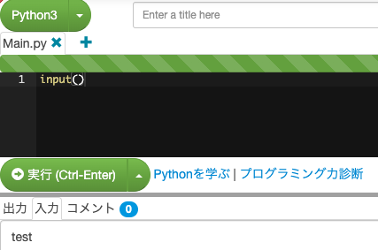

# 標準入出力

プログラムには入力された値を受け取る機能、値を出力する機能が備わっています。例えば、入力した文字列を受け取るのは`input()`でできます。値を出力したい時は`print()`でできます。`()`の中に出力したい値を入れます。

paiza.ioでは下のところに出力/入力/コメントタブがあるので入力タブをクリックすると入力欄が現れ、そこに入力することができます。



## 演習

1. 入力した値をオウム返しする文を書いてみましょう。（できれば1行で！）

::: details 答え
```python
print(input())
```
:::

2. 変数の型は`type()`で確認することができます。入力した値の型を出力してみましょう。

::: details 答え

```python
print(type(input()))
```
出力のタブを見ると`<class 'str'>`となっているはずです。strはともかくclassとは一体…？あとで解説します。
:::
