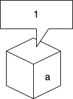

# 変数と型

## 変数

Pythonのような言語は高級言語と呼ばれていますが、私たちはただ以下の文を書くだけで変数を定義することができます。

```python
a = 1
```

このような記述を代入文(assignment statement)といいます。1という数値が記録されている領域の名前を`a`と名付けています。



::: tip
実は「1という数値」という表現には少々語弊があるのですが、Python特有の考え方があるのでここでは省略します。また詳しくなってから調べてみてください。
:::

## 型

ところで、1というのは数値としての1だけでしょうか？例えば圭一さんという人がいたとしてその「一」は1と等価でしょうか？

きっと違うという反応を期待して次に進みますが、数値としての1と文字としての「1」は違います。

じゃあどう違うのか？それを端的に表しているのが型(type)というものです。型は先ほどの話でいうと確保している領域の大きさや形（表現方法）が違いますが、ややこしくなるのでこれ以上は踏み込まないようにしましょう。

型には色々な種類がありますが、代表的に用いられてるものを挙げます。

### integer(int)

整数型と呼ばれるものです。Pythonではさほど気にしなくてもよいのですが、符号（±）のあるなし、何ビットまで表すかみたいな区別があります。いきなりビットというわけのわからないものが出てきましたが、割愛します。

### float

浮動小数点型と呼ばれるもので、実数を表すことができます。(実はすべての実数を正確に表すことは無理だったりするのですが…)

### string(str)

文字列型と呼ばれるものです。リテラルと呼ばれることもあります。

### boolean(bool)

真偽値型と呼ばれるものです。真(True)または偽(False)の2値しかとりません。

### None(null)

なんでもない型です。（ダジャレではなく）0との違いは空のペットボトルとそもそもペットボトルが存在していないみたいな例えがあります。

::: tip
型は変換(cast)することができます。もちろん情報が抜け落ちたり、エラーが発生することがありますが…
:::

変数にはミュータブル(mutable)、イミュータブル(immutable)の概念があるのですが、変更可能なのがミュータブル、変更不可能なのがイミュータブルという認識でいてください。
イミュータブルな変数を定数（constant）と呼ぶことがあります。
