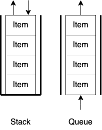

# スタックとキュー

リストによって構成されるデータ構造としてスタック(stack)とキュー(queue)というものがあります。スタックはリストの片側でしかデータの挿入と取り出しができない後入れ先出し(last-in-first-out, LIFO)の構造をしており、キューは片方からデータを挿入してもう片方からデータを取り出す先入れ先出し(first-in-first-out, FIFO)の構造をしています。キューの両端でデータの出し入れができるようなキューを両端キュー(double-ended-queue, deque)といいます。

図解したもの


## 演習
1. リストの末尾に要素を追加するメソッドがあり、`list.append(value)`でできます。逆にリストの末尾の要素を取り出すメソッドは`list.pop()`です。以下のテンプレートをもとにスタッククラスを作成してみましょう。(passと書いているところを書き換えましょう)

```python
class Stack:
    l = []
    def __str__(self):
        return str(self.l)

    def append(self, value):
        pass
    
    def pop(self):
        pass
```
::: details 答え

```python
class Stack:
    l = []
    def __str__(self):
        return str(self.l)

    def append(self, value):
        self.l.append(value)

    def pop(self):
        return self.l.pop()
```

つまり、リストは最初からスタック構造を実装しているので特段クラスを作らなくてもいいよってことでした。
:::