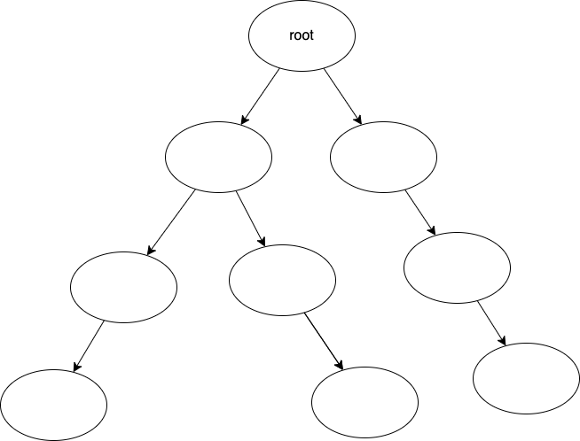

# 木構造

あらゆるところに出てくるデータ構造に木構造(tree structure)というものがあります。

木構造はあるデータ同士を親子関係でつないだ構造です。子は1つの親を持ち、親は複数の子を持つことができます。各要素は節(node)と呼び、特に親のない節のことを根(root)と呼びます。各節が子を多くとも2つ持つような木構造を二分木(binary tree)とよびます。

木構造を一般化したものとしてグラフ(graph)というのがありますが、これについては省略します。

想定読者にとって木構造の実装はやや難易度が高いため、演習は省略します。
